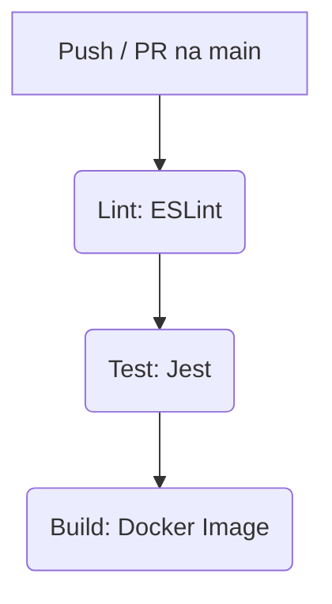

# 🚀 Lab CI/CD — Node.js + Prisma + Docker

[](https://github.com/webtech-network/lab-cicd/actions)
[](https://nodejs.org/)
[](https://www.prisma.io/)
[](https://www.docker.com/)

> Laboratório prático e avançado de CI/CD com GitHub Actions, englobando análise de código (linting), testes automatizados, build e preparação de imagens Docker.

---

## 📖 Sobre o Projeto

Este repositório serve como um laboratório completo para demonstrar uma esteira (pipeline) de CI/CD moderna. A aplicação base é uma API construída em **Node.js** com o framework **Express**, utilizando **Prisma ORM** para gestão do banco de dados (SQLite) e empacotada com **Docker**.

O foco principal é a **automatização da qualidade e entrega de software**: desde a verificação do estilo de código e execução de testes unitários até à construção da imagem do contentor.

---

## 🛠️ Stack Tecnológica

| Tecnologia | Função no Projeto |
| :--- | :--- |
| 🟢 **Node.js 20** | Ambiente de execução da aplicação (Runtime) |
| 🚂 **Express** | Framework web para a criação de rotas HTTP |
| 🗄️ **Prisma ORM** | Modelagem e comunicação com o banco de dados SQLite |
| 🃏 **Jest + Supertest** | Criação e execução de testes automatizados de integração |
| 🔍 **ESLint** | Análise estática e padronização do código-fonte |
| 🐳 **Docker** | Containerização da aplicação para garantir portabilidade |
| 🐙 **GitHub Actions** | Orquestração da pipeline de Integração e Entrega Contínuas |

---

## 📡 Referência da API

A aplicação expõe os seguintes endpoints:

### `GET /status`
Verifica a saúde da API e o status da integração.
* **Resposta de Sucesso (200 OK):**
  ```json
  {
    "status": "API Online e CI/CD configurado!"
  }

```

### `GET /users`

Retorna a lista de utilizadores registados na base de dados.

* **Resposta de Sucesso (200 OK):**
```json
[
  {
    "id": 1,
    "name": "Alice",
    "email": "alice@example.com"
  }
]

```


---

## ⚙️ Como Executar Localmente

### Pré-requisitos

* **Node.js** (versão 20 ou superior)
* **Git**
* **Docker** (opcional, caso pretenda correr o contentor)

### Passos para Instalação

1. **Clone o repositório:**
```bash
git clone [https://github.com/webtech-network/lab-cicd.git](https://github.com/webtech-network/lab-cicd.git)
cd lab-cicd

```


2. **Instale as dependências:**
```bash
npm install

```


3. **Gere o Prisma Client e crie a base de dados SQLite:**
```bash
npx prisma generate
npx prisma db push

```


4. **Inicie o servidor:**
```bash
npm run dev

```


> A API estará disponível em: `http://localhost:3000`


### Comandos Úteis (Scripts)

* `npm start` ou `npm run dev`: Inicia a aplicação.
* `npm test`: Executa a suite de testes com o Jest.
* `npm run lint`: Verifica possíveis erros e formatação no código fonte usando ESLint.

---

## 🐳 Execução com Docker

Se preferir não instalar o Node.js na sua máquina, pode correr o projeto inteiramente via Docker:

1. **Construir a imagem da aplicação:**
```bash
docker build -t lab-cicd:latest .

```


2. **Executar o contentor:**
```bash
docker run -p 3000:3000 lab-cicd:latest

```


---

## 🔄 Arquitetura da Pipeline CI/CD (GitHub Actions)

A nossa pipeline (`.github/workflows/ci.yml`) é acionada automaticamente sempre que ocorre um `push` ou `pull_request` para a branch `main`.

Os *jobs* são executados de forma estruturada:



1. **Lint (`npm run lint`)**: Verifica se o código cumpre as boas práticas definidas no `.eslintrc.json`.
2. **Test (`npm test`)**: Necessita que o *Lint* seja aprovado. Executa os testes de integração do Express com Jest/Supertest.
3. **Build (`docker build`)**: Necessita que os *Testes* passem. Constrói a imagem Docker baseada na versão testada do código (nesta fase do lab, a publicação no *registry* está desativada).

---

## 📁 Estrutura de Diretórios

```text
lab-cicd/
├── .github/workflows/   # Configurações do GitHub Actions (ci.yml)
├── prisma/              # Schema do banco de dados e ficheiro SQLite
├── src/                 # Código-fonte principal da aplicação
│   ├── app.js           # Configuração do Express e rotas
│   ├── server.js        # Ponto de entrada (inicia o servidor HTTP)
│   └── userService.js   # Regras de negócio e chamadas ao Prisma
├── tests/               # Testes automatizados (Jest + Supertest)
├── .eslintrc.json       # Configuração das regras do ESLint
├── Dockerfile           # Instruções para construir a imagem Docker
└── package.json         # Dependências e scripts do projeto

```

---

*Desenvolvido para o evento de comemoração de 10 anos do curso de Engenharia de Software.*


